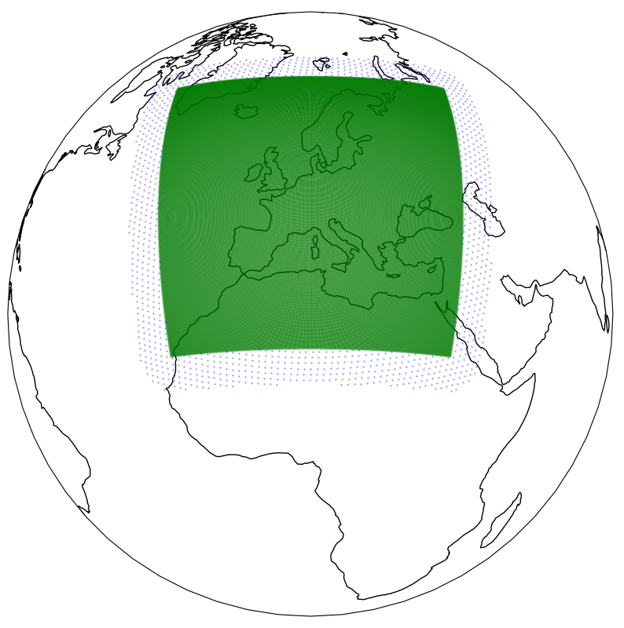
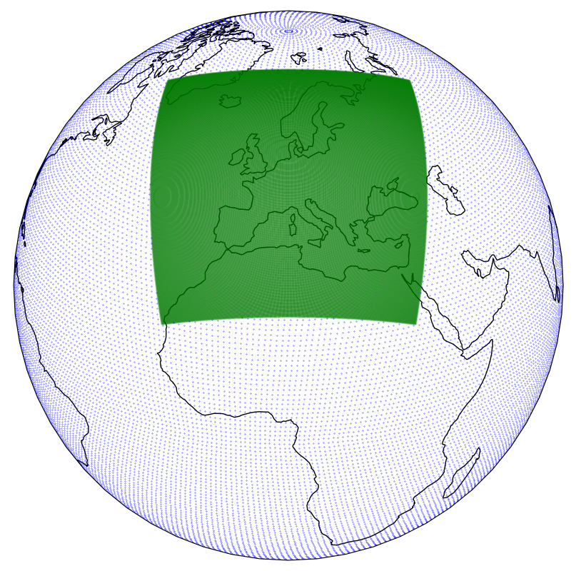
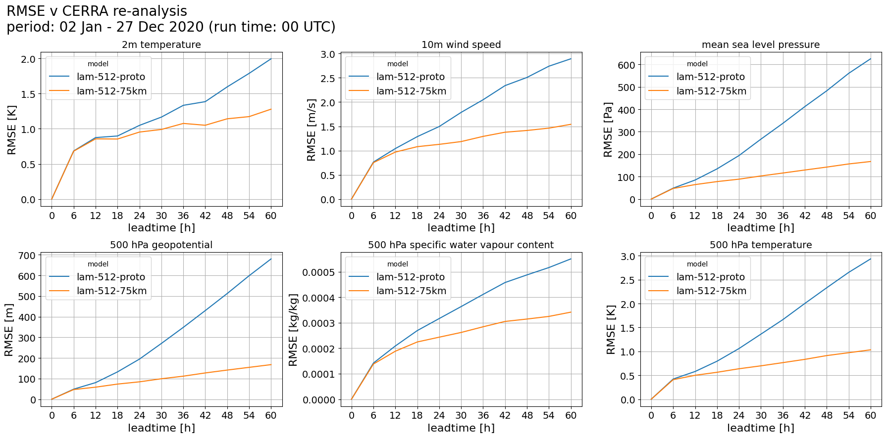
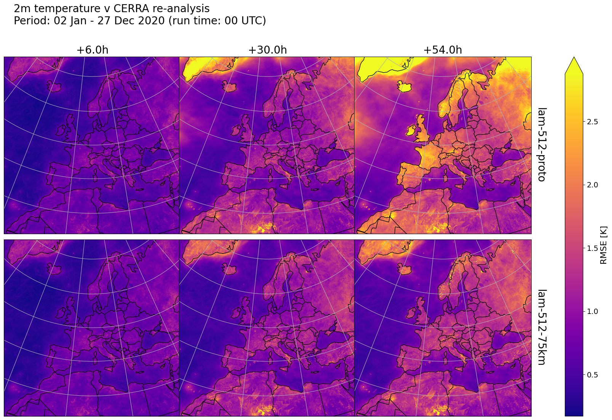
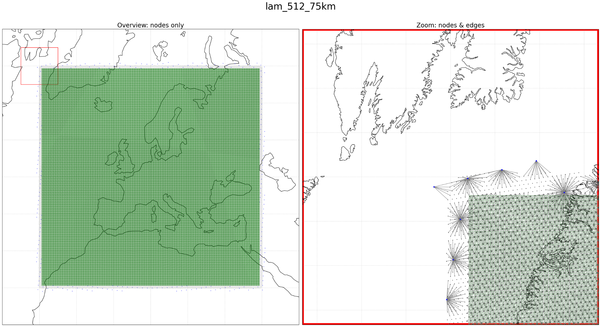

# Limited Area Modelling (LAM) in Anemoi

This document is meant as a practical, step‑by‑step guide for setting up LAM in Anemoi, with additional configuration and graph‑design guidance distilled from the LAM slide decks.

## Overview

In Anemoi, a LAM is **not** a special model class. It is the same EncProcDec forecaster, distinguished by how the dataset, graph, dataloader, and loss/rollout masks are configured:

- **Cutout dataset** (regional + boundary) defines the limited area domain.
- **Graph post‑processing** removes nodes not connected to the limited area and stores their indices.
- **Masked grid_indices** loads data only for the connected nodes.
- **output_mask** limits loss to the LAM domain and drives boundary forcings in rollouts.



## Prerequisites

1. Clone the repo and install `uv`.
1. Confirm Anemoi training CLI works:

```bash
uv run anemoi.training --help
```

3. Use the `lam` config in `training/src/anemoi/training/config/lam.yaml`.

## Step 1: Configure a cutout dataset and global domain boundary

A LAM uses a **cutout dataset** that combines a high‑resolution regional dataset with a boundary dataset (often global or wider coverage). This generates a `cutout_mask` that is `True` for the regional domain only.

**Cutout dataset config sketch:**

```yaml
# in a dataset create config
cutout:
  dataset:
    regional_dataset: <regional-dataset-path-or-uri>
    global_dataset: <boundary-dataset-path-or-uri>  # may be global or larger coverage
    adjust: all
    min_distance_km: 0
    
    .... # new parms for global domain in boundary
```

`min_distance_km`: define width of margin between regional and boundary domains. Setting this to zero makes the two domains touch without overlap, and with a positive value creates a gap betweent the two.

**Notes:**
- The `cutout_mask` is required later for graph and loss masking, and will be `True` for the regional domain and `False` for the boundary (green/blue respectively in the figure below).
- For quick testing, you can create an ERA5 subset as in `anemoi-core/NOTES.md` and use it as a boundary dataset.




## Step 2: 


## Step 2: Configure a LAM graph and keep only connected nodes

The LAM graph is built on the cutout dataset. Many global/boundary nodes will not connect to the limited‑area hidden mesh and should therefore be removed. This means that the width of the boundary is effectively determined by the connectivity of the global 

> Q: how is the LAM hidden mesh defined?

**Graph post‑processor:**

```yaml
post_processors:
  - _target_: anemoi.graphs.processors.RemoveUnconnectedNodes
    nodes_name: data
    ignore: cutout_mask        # keep the regional domain
    save_mask_indices_to_attr: indices_connected_nodes
```

This does two things:
- Drops non‑connected data nodes.
- Saves `indices_connected_nodes` as a node attribute for later use by the dataloader.


## Step 3: Use MaskedGrid for grid_indices (now irrelevant...)

The dataloader must load **only** the connected data nodes. Use a masked grid with the indices saved above.

```yaml
grid_indices:
  _target_: anemoi.training.data.grid_indices.MaskedGrid
  nodes_name: data
  node_attribute_name: indices_connected_nodes
```

**Important:** `grid_indices` is stored in the checkpoint and used by inference. LAM inference currently works only when initialized from an `anemoi-dataset`.


## Step 4: Configure output_mask for loss and rollouts (remains!)

LAMs still **forecast on the whole input domain**, but **loss is computed only on the regional domain**. This is controlled by `output_mask`.

```yaml
model:
  output_mask:
    _target_: anemoi.training.utils.masks.Boolean1DMask
    nodes_name: ${graph.data}
    attribute_name: cutout_mask
```

`output_mask` also triggers and defines the **boundary forcing** during rollouts, and is saved in the checkpoint for inference.


## Step 5: Train

Start training using the LAM config:

```bash
ANEMOI_BASE_SEED=42 uv run anemoi-training train --config-name lam
```

**Known foot gun:** dataset paths must be full paths (not `~`).

## Step 6: Design a well‑connected LAM graph

The *boundary connectivity* has a large impact on skill at longer lead times. A comparison of two models (lam‑512‑proto vs lam‑512‑75km) shows that the model with a wider hidden mesh (larger `margin_radius_km`) transfers boundary information more effectively and performs much better at later lead times.



**Guidelines:**
- Ensure enough hidden nodes are connected **exclusively** to boundary data nodes.
- The simplest way is to increase `margin_radius_km` for `LimitedAreaTriNodes`.

```yaml
hidden_nodes:
  _target_: anemoi.graphs.nodes.LimitedAreaTriNodes
  resolution: 9
  margin_radius_km: 75  # increase to ensure boundary-connected hidden nodes
```



## Step 7: Avoid spurious long edges

When using `KNNEdges` from hidden nodes to the LAM region, a hidden mesh that extends deep into the boundary can create many **long, spurious edges**. A post‑processor was added to restrict these edges.

```yaml
post_processors:
  - _target_: anemoi.graphs.processors.RestrictEdgeLength
    source_name: data
    target_name: hidden
    threshold: 20
    source_mask_attr_name: cutout
```

This is how the lam‑512‑75km graph was built.



## Quick checklist

- Cutout dataset provides `cutout_mask`.
- `RemoveUnconnectedNodes` stores `indices_connected_nodes`.
- `MaskedGrid` uses `indices_connected_nodes` to load data.
- `output_mask` applies loss to the regional domain and defines boundary forcing.
- `margin_radius_km` is large enough to connect boundary‑only hidden nodes.
- `RestrictEdgeLength` prevents long boundary‑to‑hidden edges.

## Troubleshooting

- **Ambiguous `--config`**: Use `--config-name` instead (see `anemoi-core/NOTES.md`).
- **Dataset path errors**: Use absolute paths, not `~`.
- **Unexpected validation frequency errors**: Check `dataloader.[training,validation,test].frequency` handling in LAM configs.

## References

- `anemoi-core/NOTES.md`
- `anemoi-core/notes/LAM in ANEMOI.pptx`
- `anemoi-core/notes/The importance of being well-connected.pptx`
